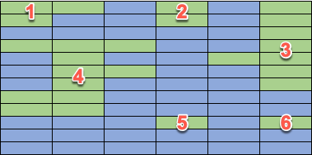
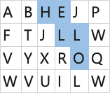
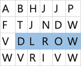

# Crack code interview problems in Rust 🦀

This repo contains the problems solved during the Crack code interview problems in Rust series from the Microsoft Reactor.

You can find details for the upcoming episodes, and register on the [Microsoft Reactor site](https://developer.microsoft.com/reactor/series/S-1110/).

## Season 1

### Episode 1 - number of islands

You have a map based off a grid of size X by Y. Each grid cell is either marked as land or sea.
Assuming all around the grid is sea, your job is to calculate the number of islands on the map.

An island is defined as a continuous set of grid cells of land that connect either above, below, left or right with another land cell. Diagonal connections are not allowed.

You can catch the recording by selecting the image below

[](https://youtube.com/watch?v=ugz1YgoZmzI)

#### Example

Here is a grid of 6x12:


The blue cells are sea, the green cells are land. This map has 6 islands:



#### Code

You can find the final code for this in the [`number-of-islands`](./number-of-islands/) folder.

### Episode 2 and 3 - Conway's game of life

[The Game of Life](https://en.wikipedia.org/wiki/Conway%27s_Game_of_Life), also known simply as Life, is a cellular automaton devised by the British mathematician John Horton Conway in 1970.

The board is made up of an `m x n` grid of cells, where each cell has an initial state: live (represented by a 1) or dead (represented by a 0). Each cell interacts with its eight neighbors (horizontal, vertical, diagonal) using the following four rules:

* Any live cell with fewer than two live neighbors dies as if caused by under-population.
* Any live cell with two or three live neighbors lives on to the next generation.
* Any live cell with more than three live neighbors dies, as if by over-population.
* Any dead cell with exactly three live neighbors becomes a live cell, as if by reproduction.

The next state is created by applying the above rules simultaneously to every cell in the current state, where births and deaths occur simultaneously. Given the current state of the `m x n` grid board, return the next state.

In this problem, given an initial state compute the next state.

We attempted this over 2 sessions, and didn't manage to complete in time as we had too much fun discussing rust features with the audience!

Episode 2 recording:

[](https://youtube.com/watch?v=0jKSfKqOoFc)

Episode 3 recording:

[](https://youtube.com/watch?v=2Dd6wACDna8)

#### Example

The state on the left gives the one on the right as the next state.

```output
0 1 0    0 0 0
0 0 1 -> 1 0 1
1 1 1    0 1 1
0 0 0    0 1 0
```

```output
1 1 -> 1 1
1 0    1 1
```

## Season 2

[Register for season 2 now](https://developer.microsoft.com/reactor/series/S-1110/)!

### Episode 1 and 2 - Word Search

Given a board made of a grid of characters, and a word, get if the word exists in the grid as contiguous characters.

The word can be constructed from any adjacent cells, up, down, left or right (but not diagonally).

Episode 1 recording:

[](https://www.youtube.com/live/rJyeQ4tIv5s?feature=share)

Episode 2 recording:

[](https://www.youtube.com/live/eYCxaTpeflU?feature=share)

#### Example 1:

Given this board:


and the word `HELLO`, the result would be `true`.



#### Example 2:

Given this board:


and the word `WORLD`, the result would be `true`.




#### Example 3:

Given this board:


and the word `RUST`, the result would be `false`. The letters are there, but only by connecting diagonally.

