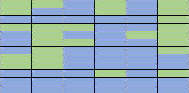
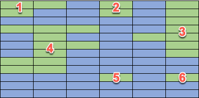

# Number of islands

You have a map based off a grid of size X by Y. Each grid cell is either marked as land or sea.
Assuming all around the grid is sea, your job is to calculate the number of islands on the map.

An island is defined as a continuous set of grid cells of land that connect either above, below, left or right with another land cell. Diagonal connections are not allowed.

You can catch the recording by selecting the image below

## Example

Here is a grid of 6x12:

The blue cells are sea, the green cells are land. This map has 6 islands:

## Tasks

1. Create a new program or library in Rust
1. Build unit tests to test your program using the test cases in this Excel document: [`islands.xlsx`](./islands.xlsx)
1. Write code to calculate the number of islands that makes your unit tests pass
